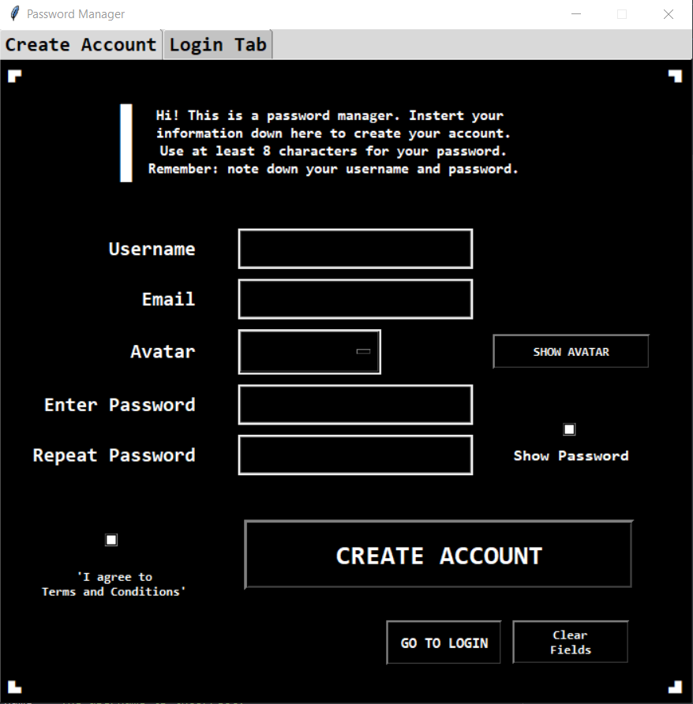
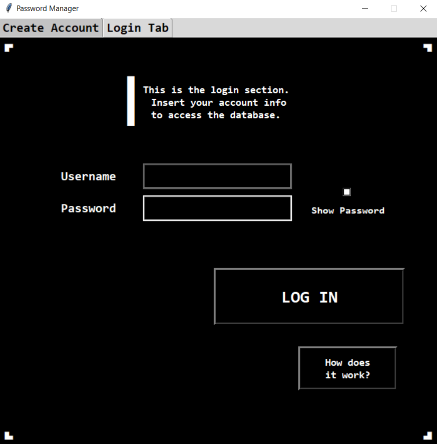
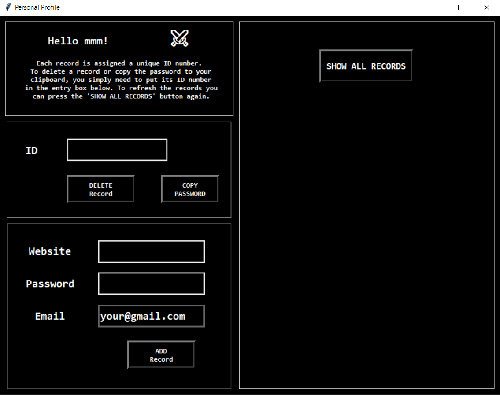

# 🔓 Password Manager

This is a password manager built with Python and implemented with the TKinter module. 
The user is able to create a single account, then access it with the correct credentials. 
A database file is created in the same folder as the script file, and it contains the 
encrypted passwords. 

**When you create an account, you must note down your username and password.**
## ⭐ Main Features

- Use of SQLite3 module to store encrypted passwords and login data
- Hash function which encrypts the master password
- Able to add, delete and show password records 
- Can copy to clipboard the password associated with a record
- Use of Fernet symmetric encryption for passwords and database information


## 🖥 GUI Screenshots








## 🧱 Modules

Python version 3 is necessary in order to run this project, as well as installing the
module below, which is not built-in. The built-in modules imported in the program are 
tkinter, sqlite3, base64, and os.

```bash
  pip install cryptography
```
    
## ⚙ How Does it Work?

The encryption uses both hashing and the Fernet module to guarantee that the plain password
 is not stored in the database file (which would pose a security risk). 

In order to encrypt with the Fernet module a 64-bit key is necessary, however this key is 
usually generated randomly to guarantee strong encryption based on it. This script instead
uses a readable password chosen by the user to generate part of the key used for encryption.

When the user sets the password, it is used to generate the 64-bit key while the program is
running (with the generate_key function). That key is unique to the user's password. After
this, the key is hashed, producing a unique string. This hashed value is stored in the 
database. 

In short: the user chooses a PASSWORD --> which generates a 64-bit KEY, used to encrypt all
the data before it enters the database --> the key is HASHED and placed in the database. 
Access to the database is granted only when the hashed value is a match. The KEY is the 
only way to decrypt the database passwords, since they have been encrypted with it.

Since it is not possible to go back from the hashed value to the key, even if
someone knows the hashed value, they will not be able to decrypt the passwords. The same
is true in case someone obtains the python code. There is no way to modify the source 
code to decrypt the database except guessing the user's password since the key to decrypt
the database is not stored in the program but generated inside it with the user's 
input as they try to log in.

This system allows the program to check whether the user has the correct master 
password, while using a secure encryption method. The user is only required to remember the
plain password and username.  


## ➕ Extra Features

- You are prevented from entering a password with less than 8 characters to improve safety.
- You can select an avatar for your profile.
- Instructions on how to use the program are shown in each tab.
- The email inserted when creating the profile is used as a default in the 'add record' tab.
- Once logged in, the program personalizes the page by adding your avatar and name to it.


